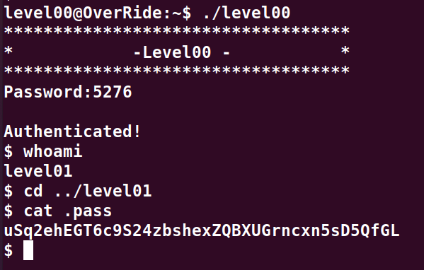

# Level00:

En preambule je pose cette liste ici, elle correspond au outils que j'utilise:
**dmesg** : permet de récupérer les messages du noyau, comme les infos de crash d’un programme (contenant l’EIP).
**strings <file>** : affiche les chaînes de caractères trouvées dans un fichier.
**nm <binary>** : liste les symboles d’un binaire : l’adresse des zones mémoires, l’adresse des fonctions, etc…
**ltrace <binary>** : liste les appels vers les fonctions contenues dans les bibliothèques partagées.
**strace <binary>** : liste les appels système et les signaux.

**Pour ce premier niveau, on peut voir dans le source.c qu'il suffit d'entrer le nombre 5276 quand le programme demande le password pour acceder a un shell.**

