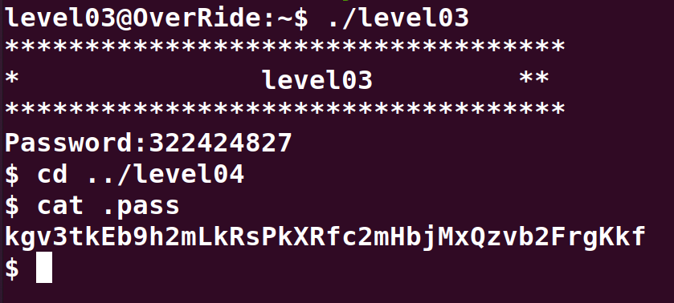

# Level03:

En premier nous devons decompiler le code et le nettoyer.
Apres cette etape cruciale, nous pouvons voir clairement un algorithme d'encodage qui comprare 2 chaines de characteres.

Avec le `main()` ci-dessous, on peut voir que la chaine est decrypte quand `i` est egal a 0x12 (18) et vaut **Congratulations!** donc la difference entre les deux parametres lors de l'appel de la fonction test doit etre de 18.
```cpp
int main()
{
    char *value = "Q}|u`sfg~sf{}|a3";
    
    for (int i = 0 ; i < 128 ; i++) {
        printf("%d : ", i);
        for (int j = 0 ; value[j] ; j++)
            printf("%c", value[j] ^ (char)i);
        printf("\n");
    }
    return 0;
}
```

Le second parametre de la fonction `test()` est toujours **322424845**, donc si on ajuste le premier parametre a **322424827** le mot de passe sera decrypte.

