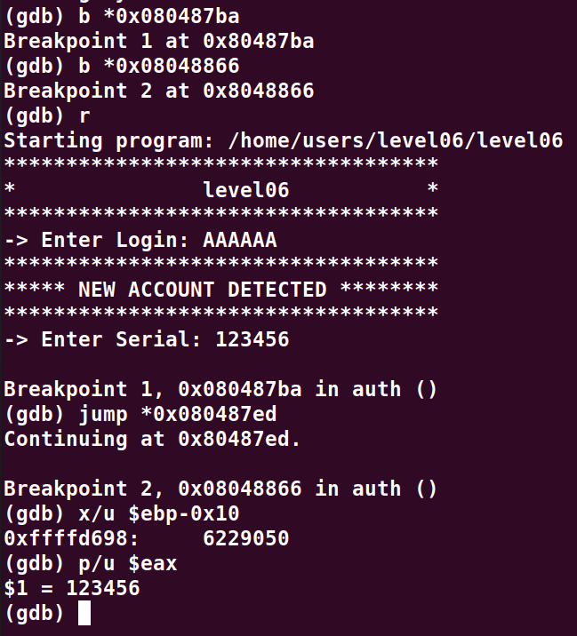
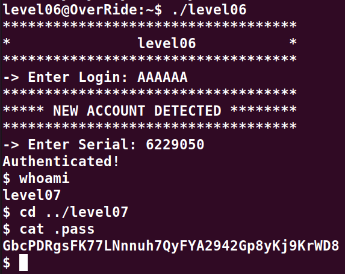

# Level07:

Ce binaire s'exploite assez simplement, le seul probleme rencontre pendant le debug fut cause par le call de `ptrace()`, il y a egalement la presence d'un canary qui empeche un **buffer overflow**.

Le code contient un `main()` et une fonction `auth()`, a l'execution il demande de rentrer un login et un serial.

Pour demarrer un shell il faut que le login une fois encrypte soit egale au serial, pour se faire nous pouvons debugger avec **gdb** et effectuer un jump pour sauter la partie du `ptrace()`

Dans ce cas il nous suffit de faire un debug pas a pas avec `gdb` en s'arretant avant d'atteindre la section du `ptrace()` :
`b *0x080487ba`

Puis nous allons set un breakpoint au niveau de la comparaison pour pouvoir en extraire les variables utiles:
`b *0x08048866`

Enfin nous allors jump directement dans le `else` pour s'arreter sur le breakpoint mis precedement:
`jump *0x080487ed`

Finalement pour afficher les valeurs qui nous interressent il faut proceder comme suit:

**Pour afficher la valeur attendue:**
x/u $ebp-0x10

**Pour afficher la valeur actuel:**
p/u $eax

Voici un exemple:

On constate donc qu'avec un login egale a **AAAAAA** on doit mettre un serial a **6229050**

On accede donc comme prevu a un shell.
