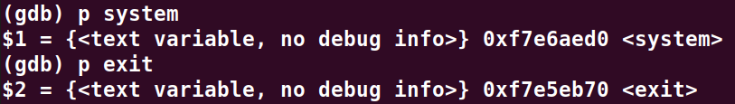
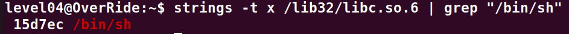
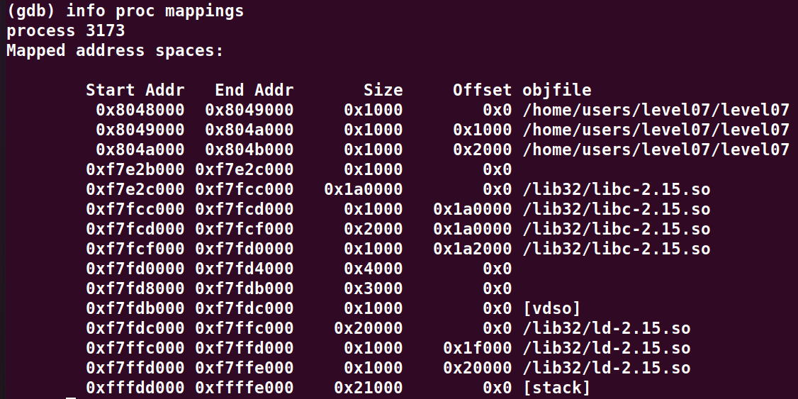
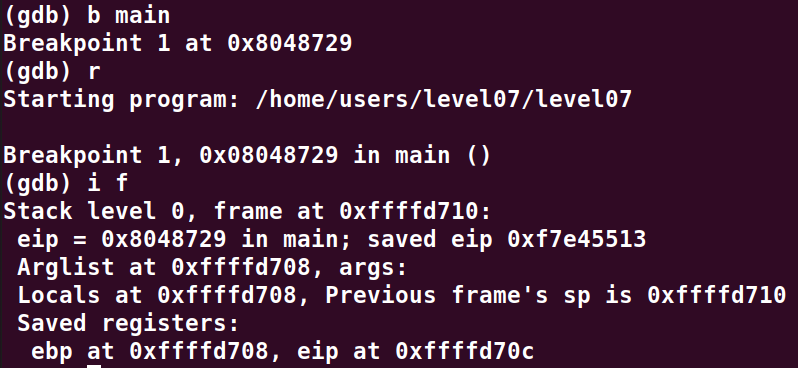
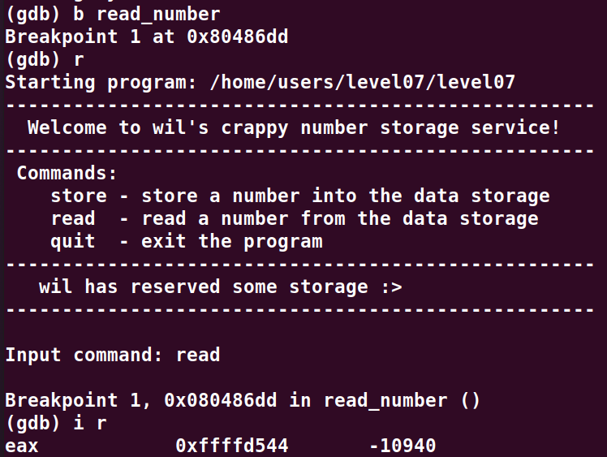
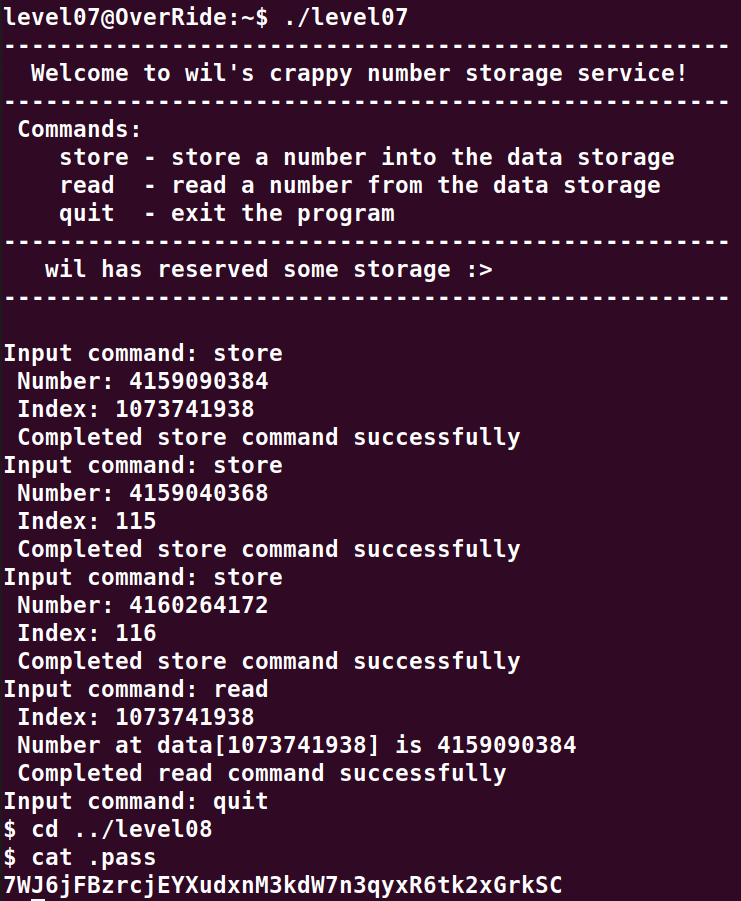

# Level07:

Dans ce niveau nous allons faire un **Return To Libc** pour acceder a un terminal, nous verrons comment plus loin.

Le programme que nous devons exploiter, est un simple prompt qui demande en boucle qu'elle action nous voulons effectuer,
nous avons alors le choix entre ces 3 actions : `store`, `read`, `quit`

- `store` demande deux **unsigned int** et permet de stocker le premier dans un tableau a l'index du deuxieme parametre.
- `read` affiche une valeur de la memoire a l'index en parametre.
- `quit` quitte simplement le programme.

Notre objectif est de stocker les valeurs requisent pour l'execution d'un **Return To Libc**, et de pointer sur la premiere adresse a l'aide de read, puis de quitter le programme.

En premier lieux nous allons donc recuperer les adresses des fonctions pour effectuer le **Return To Libc**,

Ici nous recuperont les deux premieres adresses

Et ici nous recuperont l'offset de la string **"/bin/sh"** depuis le debut de la libc

Que nous ajoutons donc a l'adresse du debut de celle de la libc (**0xf7e2c000**)

Nous obtenons donc ces adresses la:

Address de `<system>` = 0xf7e6aed0 = 4159090384
Address de `<exit>` = 0xf7e5eb70 = 4159040368
Address de `"/bin/sh"` = 0xf7f897ec = 4160264172

Maintenant que nous avons les adresses, il suffit de trouver a qu'elle a quel offset est EIP et en suite de placer ces adresses dans la memoire du programme a l'aide de la commande `store`

On a:
Address de EIP = 0xffffd70c = 4294955340
Address de array[0] = 0xffffd544 = 4294956356

Soit EIP - array[0] = 456 que l'on divise par 4 pour connaitre l'index du tableau qui correspond a l'adresse d'EIP
Nous obtenons donc 114 mais 114 % 3 est egale a 1 et nous devons alors overflow cette valeur pour pouvoir enregistrer des valeurs a cette case. 

Pour pouvoir l'overflow, il suffit d'y ajouter l'UINT_MAX soit 4294967296

4294967296 / 4 + 114 = 1073741938

Bingo, 1073741938 n'est pas un multiple de 3, nous pourrons donc nous en servir comme index.

Nous pouvons donc ecrire dans la memoire a ces 3 indexes (1073741938, 115, 116) comme suit :
- 1073741938 : 4159090384 (`<system>`)
- 115 : 4159040368 (`<exit>`)
- 116 : 4160264172 (`"/bin/sh"`)

Puis a l'aide d'un `read`, nous allons faire pointer l'adresse de retour du main vers `<system>`.
Et enfin utiliser `quit` pour arriver sur notre exploit.

On accede donc comme prevu a un shell.

