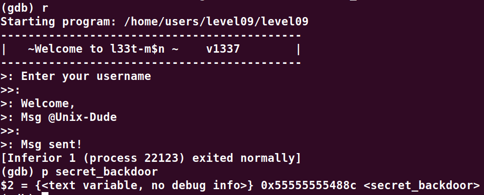
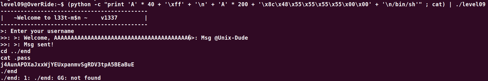

# Level09:

Dans le code source on constate qu'il y a une fonction cachee appele `secret_backdoor()`, nous devons donc trouver le moyen de sauter sur cette fonction.

Nous pouvons faire un overflow sur le message grace a la valeur mise dans le 41eme octet du username:
Le deuxiemme buffer overflow a partir du 200eme char, il nous manque donc l'adresse de la fonction a exploiter que l'on peut retrouver comme suit:

Notre exploit est donc le suivant:

(python -c "print 'A' * 40 + '\xff' + '\n' + 'A' * 200 + '\x8c\x48\x55\x55\x55\x55\x00\x00' + '\n/bin/sh'" ; cat) | ./level09

On commence par overflow le premier buffer avec le 'A' * 40 et on ajoute le \xff pour permettre le second buffer,
en suite le deuxieme buffer est remplie avec les 'A' * 200 et on y ajoute l'adresse de `secret_backdoor()`.

Enfin on passe le `/bin/sh` au programme et on accede donc au shell du dernier niveau !

